# 01. 线性代数知识图谱

线性代数是[代数学](http://baike.baidu.com/view/556393.htm)的一个分支，主要处理线性关系问题。线性关系意即数学对象之间的关系是以一次形式来表达的。例如，在解析几何里，平面上直线的方程是二元一次方程；空间平面的方程是三元一次方程，而空间直线视为两个平面相交，由两个三元一次方程所组成的方程组来表示。含有 n个未知量的一次方程称为线性方程。变于关量是一次的函数称为线性函数。线性关系问题简称线性问题。解线性方程组的问题是最简单的线性问题。

[线性](http://baike.baidu.com/view/300474.htm)（linear）指量与量之间按比例、成直线的关系，在数学上可以理解为一阶[导数](http://baike.baidu.com/view/30958.htm)为[常数](http://baike.baidu.com/view/122755.htm)的函数

[非线性](http://baike.baidu.com/view/392135.htm)（un-linear）则指不按比例、不成直线的关系，[一阶导数](http://baike.baidu.com/view/2362400.htm)不为常数。

行列式非零矩阵可逆方阵满秩向量组满秩（向量个数等于维数）。

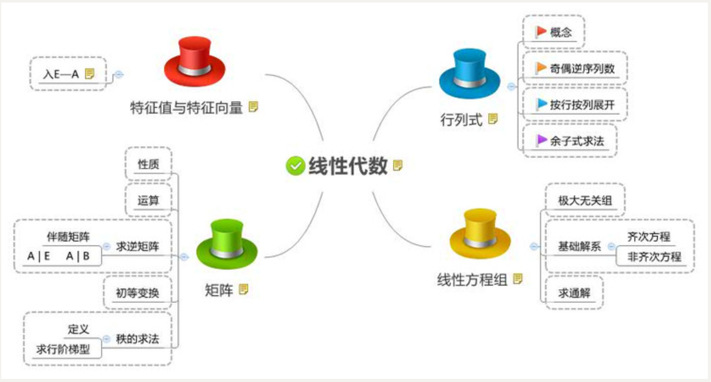

## 2. 行列式

### 2.1 定义 

矩阵的行列式，determinate（简称det），是基于矩阵所包含的行列数据计算得到的一个标量。是为求解线性方程组而引入的。

### 2.2 二阶行列式

计算方式：对角线法则

### 2.3 三阶行列式

计算方式：对角线法则

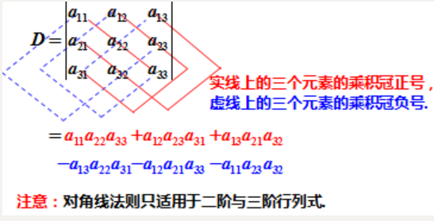
### 2.4 n阶行列式

#### 2.4.1 计算排列的逆序数

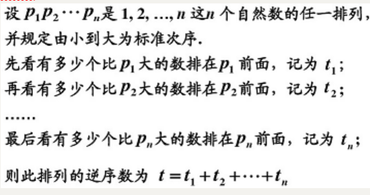

#### 2.4.2 计算n阶行列式

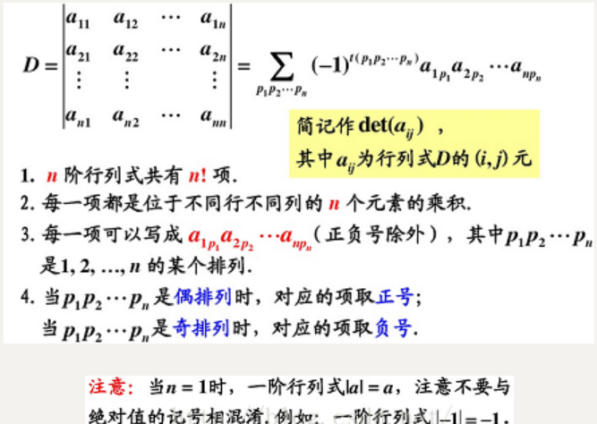

#### 2.4.3 简化计算总结

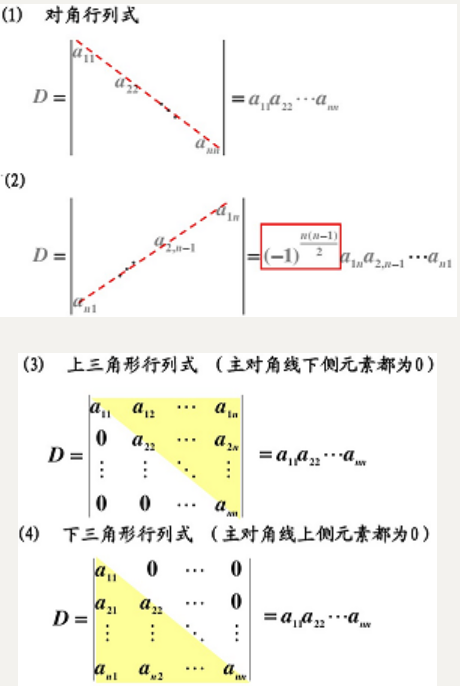

#### 2.4.4 行列式的3种表示方法

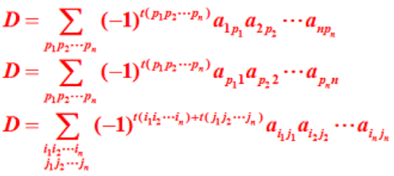
### 2.5 行列式的性质

性质1 行列式与它的转置行列式相等
注：行列式中行与列具有同等的地位,行列式的性质凡是对行成立的对列也同样成立.

性质2 互换行列式的两行（列）,行列式变号
推论 如果行列式有两行（列）完全相同，则此行列式为零

性质3 行列式的某一行（列）中所有的元素都乘以同一个倍数k，等于用数k乘以此行列式.

推论 行列式的某一行（列）中所有元素的公因子可以提到行列式符号的外面．

性质4 行列式中如果有两行（列）元素成比例，则此行列式为零．

性质5 若行列式的某一列（行）的元素都是两数之和,则等于对应的两个行列式之和.

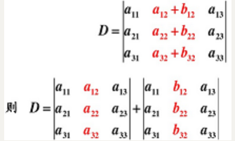

性质6 把行列式的某一列（行）的各元素乘以同一个倍数然后加到另一列(行)对应的元素上去，行列式不变．

### 2.6 计算行列式的方法

1）利用定义
2）利用性质把行列式化为上三角形行列式，从而算得行列式的值

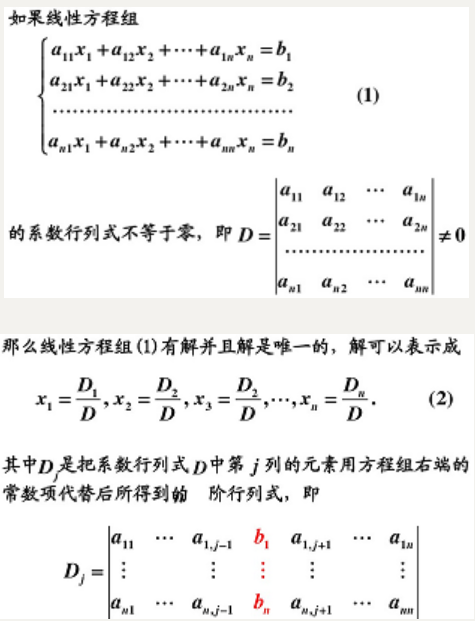

定理中包含着三个结论：
1）方程组有解；（解的存在性）
2）解是唯一的；（解的唯一性）
3）解可以由公式(2)给出.

定理4 如果线性方程组(1)的系数行列式不等于零，则该线性方程组一定有解,而且解是唯一的 .
定理4′ 如果线性方程组无解或有两个不同的解，则它的系数行列式必为零.

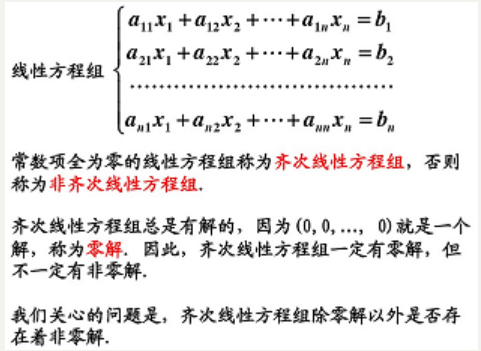

齐次线性方程组的相关定理
定理5 如果齐次线性方程组的系数行列式D不等于0，则齐次线性方程组只有零解，没有非零解.

定理5′ 如果齐次线性方程组有非零解,则它的系数行列式必为零.

1. 用克拉默法则解线性方程组的两个条件

1) 方程个数等于未知量个数；
2) 系数行列式不等于零.

2. 克拉默法则的意义主要在于建立了线性方程组的解和已知的系数以及常数项之间的关系．它主要适用于理论推导．

## 2.8 行列式按行(列)展开

对角线法则只适用于二阶与三阶行列式.

本节主要考虑如何用低阶行列式来表示高阶行列式.

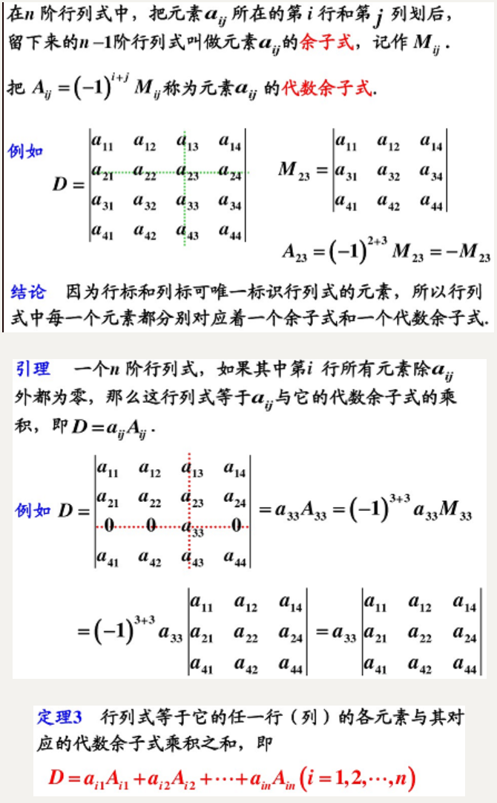

## 3. 矩阵

### 3.1 矩阵的定义

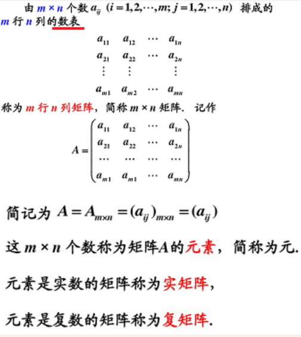

#### 3.1.1 矩阵与行列式的区别

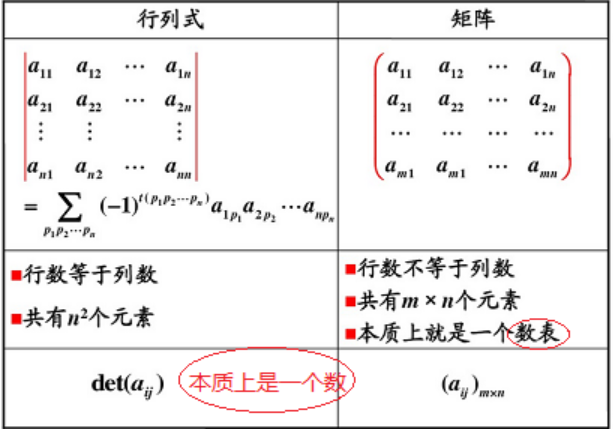

### 3.2 特殊矩阵

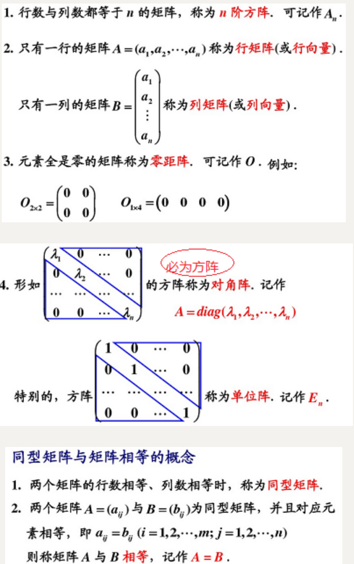

### 3.3 矩阵与线性变换

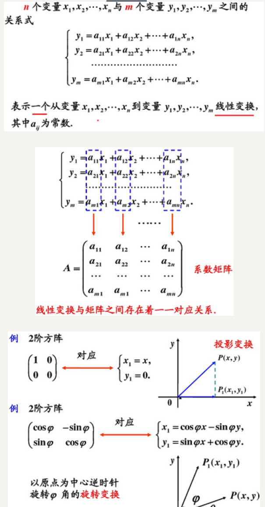

### 3.4 矩阵的运算

#### 3.4.1 矩阵的加法

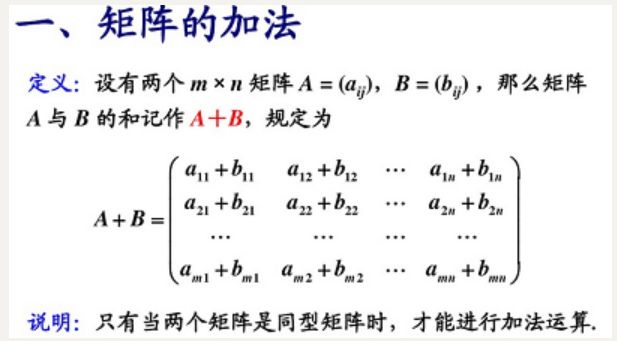

行列式与矩阵加法的比较：

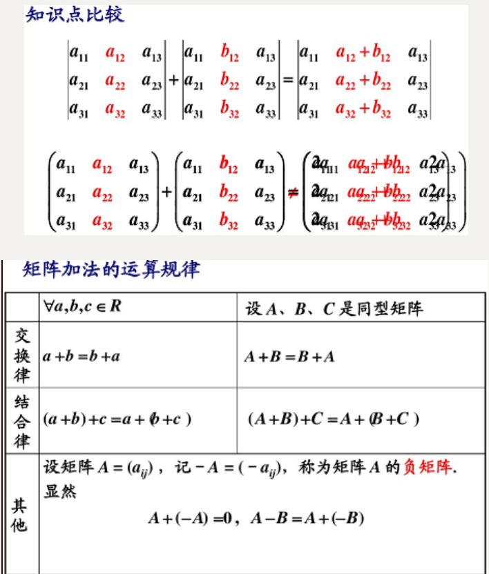

### 3.4.2 数乘矩阵

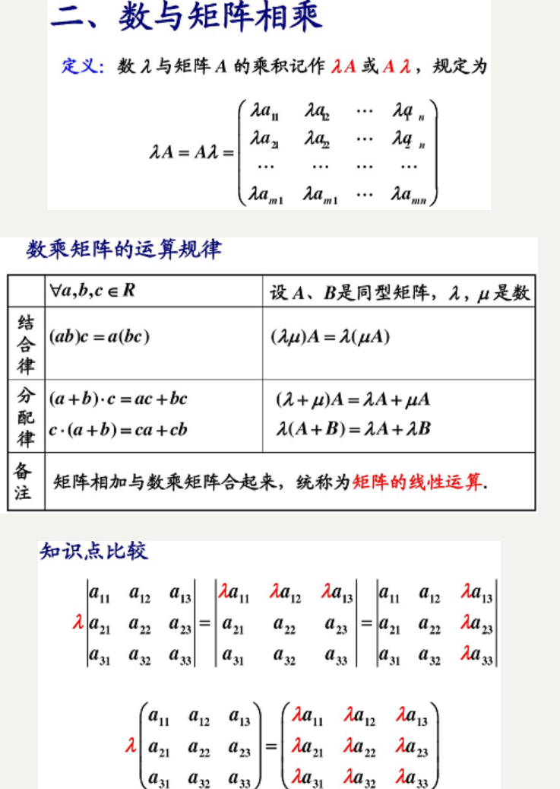

#### 3.4.3 矩阵与矩阵相乘

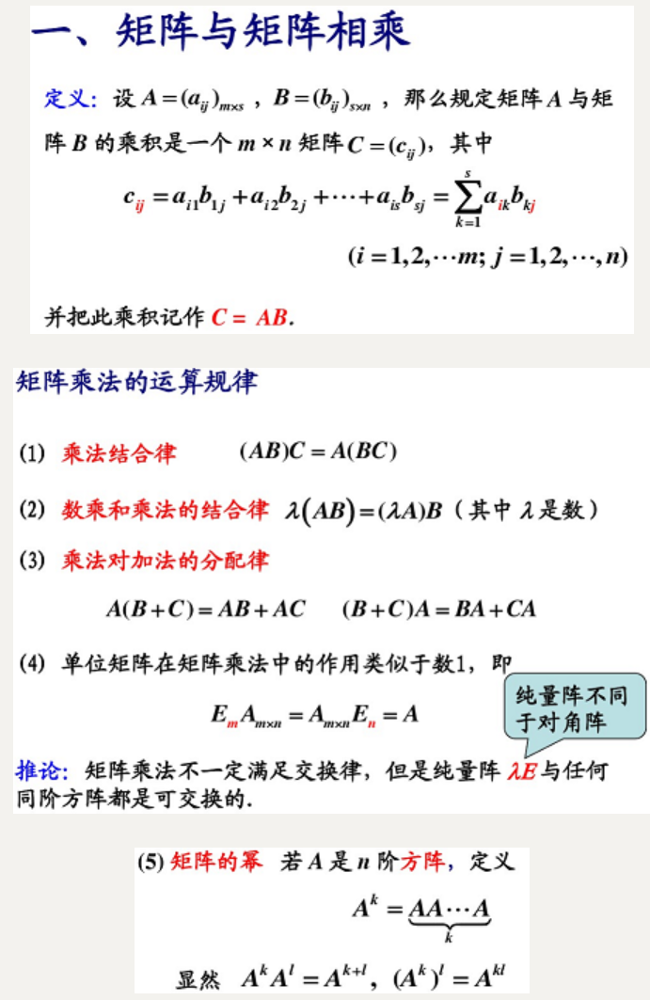

#### 3.4.4 矩阵的转置

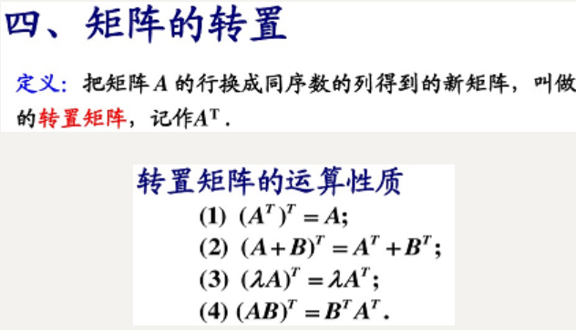

反对称矩阵(skew symmetric matrix)

#### 3.4.6 伴随矩阵

定义：行列式|A|的各个元素的代数余子式$A_{ij}$所构成的如下矩阵

$A^*$=            
$$
\begin{pmatrix}
   A_{11} & A_{21} &...& A_{n1} \\
   A_{12} & A_{22} &...& A_{n2} \\
   ... & ... & ... & ...\\
   A_{1n} & A_{23} & ... &A_{nn}
\end{pmatrix}
$$
​     称为矩阵A的伴随矩阵

性质$AA^*=A^*A=|A|E$

#### 3.4.7 共轭矩阵

### 3.5 可逆矩阵(或称 非奇异矩阵 )

### 3.6 矩阵分块法

分块矩阵不仅形式上进行转置，而且每一个子块也进行转置．

## 4. 矩阵的初等变换与线性方程组

### 4.1 矩阵的初等变换

### 4.2 矩阵之间的等价关系

### 4.3 初等变换与矩阵乘法的关系

### 4.4 矩阵的秩

### 4.5 线性方程组的多解

