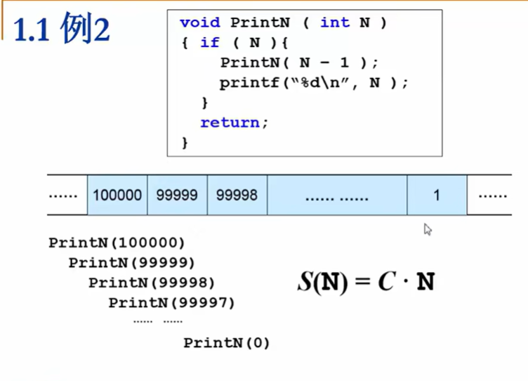

# 数据结构与算法

## 图书例子：如何在书架上摆放图书？

> 操作1：怎么插入新书：分类插入（缩小范围）
>
> 
>
> 操作2：怎么找到某本指定的书


例题：输入n，打印1~n

普通做法：

```c
void PrintN(int N)
{
    int n;
    for(i=1;i<=N;i++){
        printf("%d",i);
    }
    return;
}
```

递归做法：

```c
void PrintN(int N)
{
    if(N){
        PrintN(N-1)
            printf("%d",N);
    }
    return;
}
```

 占用空间过大。


## 什么是数据结构

- 数据对象在计算机中的组织方式

> 物理存储结构
>
> 逻辑结构

- 数据对象必定与一系列加在其上面的操作相关联
- 完成这些操作所用的方法就是算法

## 抽象数据类型

- 数据类型

数据对象集

数据集合相关联的操作集

- 抽象：描述数据类型的方法不依赖于具体实现

与存放数据的机器无关

与数据存储的物理结构无关

与实现操作的算法和编程语言均无关


## 算法

- 定义：

> 一个有限指令集
>
> 接受一些输入
>
> 产生输出
>
> 一定在有限步骤之后终止
>
> 每一条指令必须：
>
> > - 有充分的目标，不可以有歧义
> > - 计算机能处理的范围之类
> > - 描述应不依赖于任何一种计算机语言以及具体的实现手段

例：

```c
void SelectionSort(int List[],int N)
{/*将N个整数List[0]...List[N-1]进行非递减排序*/
    for(i=0;i<N;i++){
        MinPosition=ScanForMin(List,i,N-1);
        /*从List[i]到List[N-1]中找到最小元,并将其位置赋给MinPosition*/
            Swap(List[i],List[MinPosition]);
            /*将未排序部分的最小元换到有序部分的最后位置*/
    }
}
```

### 什么是好的算法

- 空间复杂度S（n）——根据算法写成的程序在执行时占用存储单元的长度
- 时间复杂度T（n）——根据算法写成的程序在执行时耗费时间的长度

例：



- 在分析一般算法的效率时，我们经常关注下面两种复杂度

> 最坏情况复杂度
>
> 平均复杂度

### 复杂度的渐进表示法


  

### 大o表示法：时间复杂度计算法

- 一层循环：

解题思路：

题目：

```c
i=n*n;
while(i!=1)
    i=i/2;
```

  解：                                       

1. 列出循环趟数t及每轮循环i的变化值           
2. 找到t和i的关系                                                  
3. 确定循环停止条件
4. 联立两式解方程
5. 写结果


- 两层循环：

题目：

```c
int m=0,i,j;
for(i=1;i<=n;i++)
    for(j=1;j<=2*i;j++)
        /*若内循环是j<=一个定值比如N，那么不用求和直接乘就好了*/
        m++;
```

解：

1. 列出外层循环中i的变化值
2. 列出内层语句中执行次数
3. 求和，写结果


  

## 线性表

- 线性表：由同类数据元素构成有序序列的线性结构

> 表中元素个数称为线性表的长度
>
> 线性表没有元素时，称为空表
>
> 表起始位置称为表头，结束位置称为表尾，i为ai的位序
>
> 若记为a1,a2,......an,称为ai-1是ai的直接前驱元素，ai+1是ai的直接后驱元素

数据对象集：线性表是n(>=0)个元素构成的有序序列

操作集：线性表L属于List，整数i表示位置

线性表基本操作主要有：


例子：假设la表示集合A，lb表示B，若想要将A，B并集。即让集合A=A交B（把B中存在但A中不存在的插入A）

```c
void unionl(Sqlist *la,Sq;ist *lb)
{
    int la-len,lb-len,i;
    ElemType e;                             /*声明与la和lb相同的数据元素e*/
    la-len=Listlength(*la);                 /*求线性表的长度*/
    lb-len=Listlength(*lb);
    for (i=1;i<=lb-len;i++)
    {
        GetElem(lb,i,&e);                   
        if(!locateElem(*la,e))              /*la中不存在和e相同数据元素*/
            ListInsert(la,++la-len,e);      /*插入*/
    }
}
```

- 顺序存储定义；

  线性表的顺序存储结构，指得是用一段地址连续的存储单元依次存储线性表的数据元素

- 线性表的顺序存储实现

  ```c
  #define MAXSIZE 20                 /*存储空间初始分配量*/
  typedef int ElemType;              /*ElemType类型更具实际情况而定，这里为int*/
  typedef struct
  {
      ElemType data[MAXSIZE];        /*数组，存储数据元素*/
      int length;                    /*线性表当前长度*/
  }Sqlist;
  ```

  

利用数组的连续存储空间顺序存放线性表的各元素


主要操作的实现：

1 .初始化（建立空的顺序表）

```c
List MakeEmpty()
{
    List Ptrl;
    Ptrl=(List)malloc(sizeof(struct LNode));
    Ptrl->Last=-1;
    return Ptel;
}
```

2 .查找


3 .插入操作实现


```c
Status ListInsert(Sqlist *L,int i,ElemTYpe e)
{
    int k;
    if(L->length==MAXSIZE)                           /*顺序线性表已经满*/
        return ERROR;
    if(i<1||i>L->length+1)                           /*当i比第一位置小或者比最后一位置后一位置还大时*/ 
        return ERROR;
    if (i<==L->length)                               /*若插入数据位置不在表尾*/
    {
        for(k=l->length-1;k>=i-1;k--)                /*将要插入位置后的元素向后移一位*/
    }
      L->data[i-1]=e;                                /*插入新元素*/
      L->length++;
    return OK;
}
```


空（等待写）


### 线性表基础操作

- 顺序存储代码实现

 ```c
 #include<stdio.h>
 #include<stdlib.h>
 #define MAX 20
 #define LISTINCREMENT 10
 
 
 typedef struct{
  int *elem;
  int length;
  int listsize;
 }sqlist;
 
  void Creatlist(sqlist &L){
   //创建一个线性表
   L.elem=(int *)malloc(MAX*sizeof(int)) ;
   if(!L.elem)return ;
   L.listsize=MAX;
   printf("输入表的长度：");
   scanf("%d",&L.length);
   printf("输入%d的个数：",L.length); 
   for(int i=0;i<L.length;i++)
   scanf("%d",&L.elem[i]);
  }
  
  //开始添加取地址符号 
  void Traverse(sqlist &L){
   //遍历
   printf("表中数据为：") ;
   for(int i=0;i<L.length;i++)
   printf("%3d",L.elem[i]) ;
   printf("\n");
  }
  
 //查找
  void LocateElem(sqlist &L,int e){
   int i;
   printf("输入要查找的元素：\n");
   scanf("%d",&e);
   for(int i=0;i<L.length;i++)
   {
    if(L.elem[i]==e){
     printf("查找成功，查找元素为%d",L.elem[i]);
     printf("\n");
     return ;
    }//if
    } //for
   printf("查找失败！");
   printf("\n"); 
   
  }//void
 
 //确定要删除的元素
  int makesureElem(sqlist &L,int e){
   int i;
   
   for(i=0;i<L.length;i++){
    if(L.elem[i]==e){
     printf("要删除的元素 位置为%d",i+1);
     printf("\n");
     return (i+1);
    }//if
   } //for
   printf("元素不存在！");
   printf("\n");
   
   return 0;
  }
  
  //插入某个元素
  void Listinsert(sqlist &L){
   int i;int e;
   printf("输入要插入位置及元素\n");
   scanf("%d%d",&i,&e);
   printf("在顺序线性表中第%d个位置之前插入新的元素%d。\n",i,e);
   //在顺序线性表L中第i个位置之前插入新的元素e
   if(i<1||i>L.length+1)return;
 //  1<=i<=listlength(L)+1;
 int *p,*q;
 q=&(L.elem[i-1]);
 for(p=&(L.elem[L.length-1]);p>=q;--p)*(p+1)=*p;
 *q=e; 
 
 ++L.length;
  
 return;
  }
  
  int listdelete(sqlist &L){
   //删除元素
   int i,e;
   printf("输入要删除的元素\n");
   scanf("%d",&e);
   i=makesureElem(L,e);
   if((i<1)||(i>L.length))return 0;
   else{
    int *p,*q;
    p=&(L.elem[i-1]);
    e=*p;
    q=L.elem+L.length-1;
    for(++p;p<=q;++p)*(p-1)=*p;//被删除元素之后的元素左移
    -L.length;
    printf("元素被删除！"); 
     
   }
    return 0;
  } 
  
  
  
 int main(){
  sqlist L;
 Creatlist(L);
 
  Traverse(L);
  LocateElem(L,1);
  
  Listinsert(L);
  Traverse(L);;
  
  listdelete(L);
  Traverse(L);
  return 0;
 } 
 ```


- 链式存储实现

```c
#include <stdio.h>
#include <stdlib.h>
#include <malloc.h>

struct  danlianbiao_Node{

int data;
struct danlianbiao_Node *next;

};

//base的结构体 
 struct  danlianbiao{

int length;
struct danlianbiao_Node *base;

};

  struct danlianbiao *danlianbiao_init();
 void danlianbiao_free(struct danlianbiao *list); 
//清除 
 void danlianbiao_clear(struct danlianbiao *list);
 int danlianbiao_length(struct danlianbiao *list);
 
//添加 
 void danlianbiao_add(struct danlianbiao *list,int index,int value);
 void danlianbiao_remove(struct danlianbiao *list,int index);
 
//修改
 void danlianbiao_set(struct danlianbiao *list,int index,int value);
 int danlianbiao_get(struct danlianbiao *list,int index );
 
 //查询
 int danlianbiao_lookup(struct danlianbiao *list,int value);
int danlianbiao_isempty(struct danlianbiao *list,int value);


void menu()
{
 printf("********目录*******\n");
 printf("输出单链表中的各元素值1\n");
 printf("在单链表中插入数据元素2\n");
 printf("在单链表中插入数据元素3\n");
 printf("寻找单链表中某一个数值4\n");
 printf("结束程序           0\n"); 
 printf("**********************************\n"); 
}

int main(int argc, char *argv[]) {
 
 int n,m,i,e;
 
  printf("请输入元素的个数 :");
  scanf("%d",&n);
  printf("以此输入%d个数据元素 :",n); 
  menu();
  printf("输入你的选择：");
  scanf("%d",&m);
  switch(m)
  {
   
   case 1:
    printf("现在链表的元素为：");
     break;
 case 2:
  printf("依次输入插入位置和数据元素（空格隔开）：");
  scanf("%d %d",&i,&e);
  
   } 
 return 0;
}


 struct danlianbiao *danlianbiao_init(){
 struct danlianbiao *list=NULL;
 list=( struct danlianbiao *)malloc(sizeof( struct danlianbiao ));
 list->base=(struct danlianbiao_Node *)malloc(sizeof(struct danlianbiao_Node));
 list->base->data=-1;
  list->base->next=NULL;
  list->length=0;
  return list;
 
 }
 
 
  
 void danlianbiao_free(struct danlianbiao *list){
 struct danlianbiao_Node *pnode=NULL;//可能出现问题指针 
 while(list->base!=NULL){
  pnode=list->base;
  list->base=pnode->next;
  free(pnode);
  
 }//while
  free(list);
 
 } 
 

//清除 
 void danlianbiao_clear(struct danlianbiao *list){
  
  struct danlianbiao_Node *next=NULL;//可能出现问题指针 
  struct danlianbiao_Node *pnode=NULL;
 while(list->base->next!=NULL){
 next=list->base->next;
  list->base->next=next->next;
  free(pnode);
  
 }//while
 list->length=0;
 }
 
//获得单链表的长度 
 int danlianbiao_length(struct danlianbiao *list){
  
  
  
 }
 
//添加 ,该函数没有错误 
 
 void danlianbiao_add(struct danlianbiao *list,int index,int value){
  int i=0;
  struct danlianbiao_Node *pnode=NULL;
  struct danlianbiao_Node *p=NULL;
  p=(struct danlianbiao_Node *)malloc(sizeof(struct danlianbiao_Node ));
  p->data=value;
  pnode=list->base;
  while(i<index-1&&pnode!=NULL){
   pnode=pnode->next;
   i++; 
  }//while
  p->next=pnode->next;
  pnode->next=p;
  list->length++;
 
 } 
 //
 //移除这一项没有错误 

 void danlianbiao_remove(struct danlianbiao *list,int index){
 struct danlianbiao_Node *pnode=NULL;
  struct danlianbiao_Node *p=NULL;
  p=(struct danlianbiao_Node *)malloc(sizeof(struct danlianbiao_Node ));
  //有错误 
  int value;int i;
     p->data=value;
  pnode=list->base;
  while(i<index-1&&pnode!=NULL){
   pnode=pnode->next;
   i++; }
   p=pnode->next;
   pnode->next=p->next; 
   free(p);

 } 
  
//设置值 ,这一项没有错误 

 void danlianbiao_set(struct danlianbiao *list,int index,int value){
   int i=0;
  struct danlianbiao_Node *pnode=NULL;
  struct danlianbiao_Node *p=NULL;
  p=(struct danlianbiao_Node *)malloc(sizeof(struct danlianbiao_Node ));
 
  p->data=value;
  pnode=list->base;
  while(i<index-1&&pnode!=NULL){
   pnode=pnode->next;
   i++; 
  }//while
  pnode->data=value;
  
 }
 
 
//得到一个数值函数方法没有错误 
 
 int danlianbiao_get(struct danlianbiao *list,int index ){
   int i=0;
   int value;
  struct danlianbiao_Node *pnode=NULL;
  struct danlianbiao_Node *p=NULL;
  p=(struct danlianbiao_Node *)malloc(sizeof(struct danlianbiao_Node ));
 
  p->data=value;
  pnode=list->base;
  while(i<index-1&&pnode!=NULL){
   pnode=pnode->next;
   i++; 
  }//while
 return( pnode->data);
  
  
  
 }
 

 //
 
 int danlianbiao_lookup(struct danlianbiao *list,int value){
  
  int i=0;
   struct danlianbiao_Node *pnode=NULL;
   for(pnode=list->base->next;pnode !=NULL;pnode=pnode->next){
    i++;
    if(pnode->data==value) {
     return i;
    }//if
   }//for
  return 0;
 }

int danlianbiao_isempty(struct danlianbiao *list,int value){
}
```

